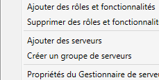
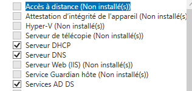
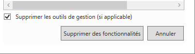
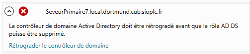
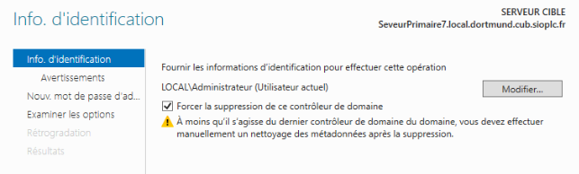
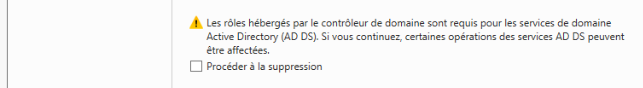
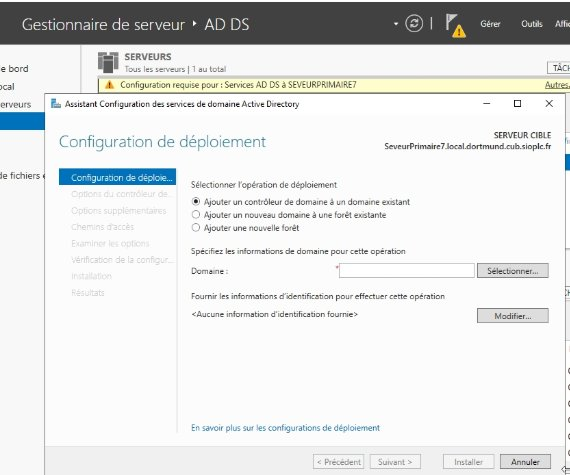
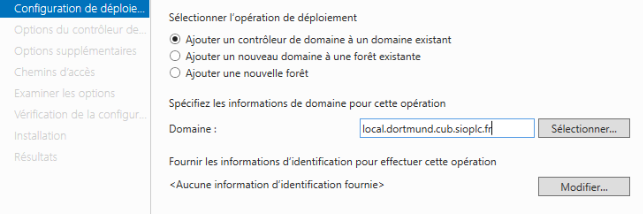
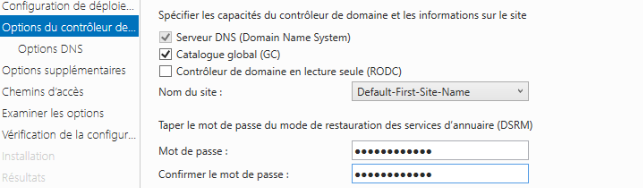
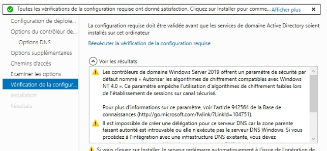

|
**BTS SIO BLOC 2**

**Admin Sys**
|***Effectuer la redondance d’un AD avec un autre***|**Fiche de procédure 7**|
| :- | - | :-: |
## **Désinstallation du deuxièmes AD DS**
Pour pouvoir effectuer la redondance il va falloir déseinstaller le deuxiémes AD DS pour le réinstaller 

On va faire supprimer des rôles et fonctionnalité 

on sélectionne AD DS pour le supprimez 

on fait supprimez

Il faut faire rétrograder le contrôleur de domaine

on sélectionne forcer la suppression 

On fait procéder à la suppression

on mais le mot de passe admin et ensuite on va faire retrogration pour pouvoir le supprimez
## **On peut faire maintenant la configuration**

On va dans le petit drapeau et on fait promouvoir 

On fait ajouter a un domaine existant et on mais le domaine et dans info identification on mais l’utilisateur admin et mot de passe

Pour identifiant mot de passe il faut mettre <Administrateur@local>,dortmund,cub,sioplc,fr CubCub\_007

On mais le mot de passe pour une récupération future

On met suivant sur toute les étapes jusqu’à arriver à cette page et on fait installer et normalement il redémarre et sa fonctionne.

Sur le serveur primaire mettre le DNS du serveur de redondance et sur le serveur de redondance mettre ceelle du serveur primaire 
BTS SIO – BLOC2 – *fiche procédure n°5 – Configuration Failover Windows Server 2012*Page 4
