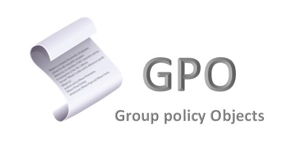
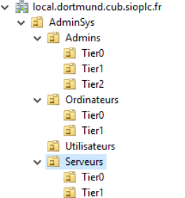
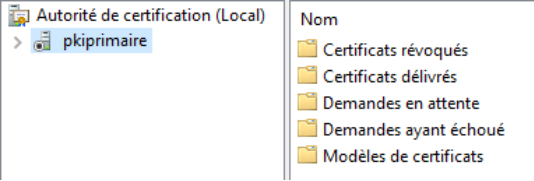

**6ieme situation - « Strategie de groupe (GPO)»**

**Contexte : CUB**

**Réaliser par** **:** Lucien BESCOS 

**Sommaire**

**Context : CUB**

[Question 1 : Pourquoi l'authentification par login et mot de passe est problématique pour se connecter avec un compte "Administrateur du domaine" ?.................................................................3 ](#_page2_x56.70_y109.55)[Question 2 :...........................................................................................................................................3 ](#_page2_x56.70_y328.60)[Question](#_page2_x56.70_y493.70) [3](#_page2_x56.70_y493.70) [:](#_page2_x56.70_y493.70) [Quelles](#_page2_x56.70_y493.70) [sont](#_page2_x56.70_y493.70) [les](#_page2_x56.70_y493.70) [fonctions](#_page2_x56.70_y493.70) [du](#_page2_x56.70_y493.70) [code](#_page2_x56.70_y493.70) [PIN](#_page2_x56.70_y493.70) [et](#_page2_x56.70_y493.70) [du](#_page2_x56.70_y493.70) [code](#_page2_x56.70_y493.70) [PUK](#_page2_x56.70_y493.70) [?..............................................3](#_page2_x56.70_y493.70)

[Question](#_page2_x56.70_y630.80) [4](#_page2_x56.70_y630.80) [:](#_page2_x56.70_y630.80) [Pourquoi](#_page2_x56.70_y630.80) [est-il](#_page2_x56.70_y630.80) [obligatoire](#_page2_x56.70_y630.80) [de](#_page2_x56.70_y630.80) [les](#_page2_x56.70_y630.80) [modifier](#_page2_x56.70_y630.80) [avant](#_page2_x56.70_y630.80) [de](#_page2_x56.70_y630.80) [mettre](#_page2_x56.70_y630.80) [en](#_page2_x56.70_y630.80) [œuvre](#_page2_x56.70_y630.80) [la](#_page2_x56.70_y630.80) [nouvelle authentification ?..................................................................................................................................4 ](#_page2_x56.70_y630.80)[Question 5 : Démontrer en quoi l'authentification TOTP est jugée moins robuste que l'authentification par certificat X509 stocké sur une clé ? Mise en place de la solution technique.....4 ](#_page3_x56.70_y109.55)[Question 6 :Pourquoi le RSSI vous a-t-il conseillé de créer 4 comptes distincts (utilisateur standard, admin tier 2, admin tier 1 et admin tiers 0) pour le même collaborateur David Balny, Administrateur Système de l'entreprise ?......................................................................................................................5](#_page4_x56.70_y109.55)
# **Question 1 : Pourquoi l'authentification par login et mot de passe est problématique pour se connecter avec un compte "Administrateur du domaine" ?**
L’authentification par login / mot de passe pour le compte Administrateur du domaine est problématique parce que :

- Un simple mot de passe peut être volé (phishing, fuite AD…).
- Si ce mot de passe est compromis, l’attaquant obtient tous les droits sur tout le domaine.
- Elle ne vérifie pas vraiment l’identité, contrairement à un certificat.
- C’est la méthode la plus vulnérable pour **un des comptes les plus sensibles** d’Active Directory.
# **Question 2 :** 
Une authentification multifacteur forte (MFA) consiste à vérifier l’identité d’un utilisateur en demandant au moins deux facteurs différents parmi :

- Ce qu’il sait : mot de passe, code PIN
- Ce qu’il possède : smartphone, token, carte à puce
- Ce qu’il est : empreinte, visage, biométrie
# **Question 3 : Quelles sont les fonctions du code PIN et du code PUK ?**
- Code PIN : sert à déverrouiller et utiliser la carte SIM ou la carte à puce (accès normal).
- Code PUK : sert à réinitialiser le PIN quand il a été bloqué après plusieurs mauvaises tentatives.
# **Question 4 : Pourquoi est-il obligatoire de les modifier avant de mettre en œuvre la nouvelle authentification ?**
Pour éviter le blocage de la clé lors de la mise en œuvre de la nouvelle authentification.

**Question 5 : Démontrer en quoi l'authentification TOTP est jugée moins robuste que l'authentification par certificat X509 stocké sur une clé ? Mise en place de la solution technique**

**TOTP moins robuste car  :**

- Peut être cloné (secret copiable), volé (smartphone) ou phishé (code saisi sur un faux site).
- Ne garantit pas la possession d’un matériel unique.

**Certificat X.509 plus robuste car :**

- Clé privée stockée dans un support matériel non extractible.
- Nécessite présence physique + PIN.
- Impossible à copier ou phisher.

**Mise en place de la solutions technique** 

**A - Parametrage de l’AD**

**Question 6 :Pourquoi le RSSI vous a-t-il conseillé de créer 4 comptes distincts (utilisateur standard, admin tier 2, admin tier 1 et admin tiers 0) pour le même collaborateur David Balny, Administrateur Système de l'entreprise ?**

On a créer 4 utilisateur pour Balny car ils auront pas les même droit pour limiter les risques si un compte et corrompus donc l’utilisateur balny à les droit de base, le premier niveau de admin a certain droit d’admin etc.

Donc ils y a plusieur compte pour limiter l’impact si il y en a un qui est perdu
# **Question 7 :** 
Un poste d’administration est un poste qui va pouvoir effectuer des taches sur les serveur et autre donc il a accées au droit que les utilisateur n’ont pas. il est placé dans cette uniter car il sera impacter par des régles différente des autres GPO
# **Question 8 : Quelle est la fonction d'une PKI ?**
Une PKI (Public Key Infrastructure) gére, distribuer et vérifie les certificats numériques et les paires de clés utilisées pour une cryptographie asymétrique.
# **Question 9 : Quel est l'intérêt de disposer d'une PKI interne plutôt que de certificats auto-signés dans une organisation ?** 
Une PKI interne permet de centraliser la gestion des certificats, d’assurer une confiance automatique dans toute l’organisation, de faciliter leur renouvellement/révocation et d’éviter les avertissements de sécurité.

À l’inverse, les certificats auto-signés sont difficiles à gérer, non fiables à grande échelle et doivent être approuvés manuellement.

# **Question 10 : Lors de la création de la clé privée de la PKI, est-il préférable de choisir l'algorithme de chiffrement RSA ou ECDSA ?**
Si nous utilisons des yubikey il vaut moieux choisir ECDSA car : 

il offre une sécurité plus élevée avec des clés plus courtes, ce qui le rend plus rapide et plus efficace, notamment sur les clés matérielles comme les yubikey qui sont optimiser pour cet algo

**Question 11 : Choisir SHA256 ou SHA1 ?** 

Sha256 car Sha1 est obselette
**SIO2 BLOC 2 – Contexte : CUB – Admin SYS**
