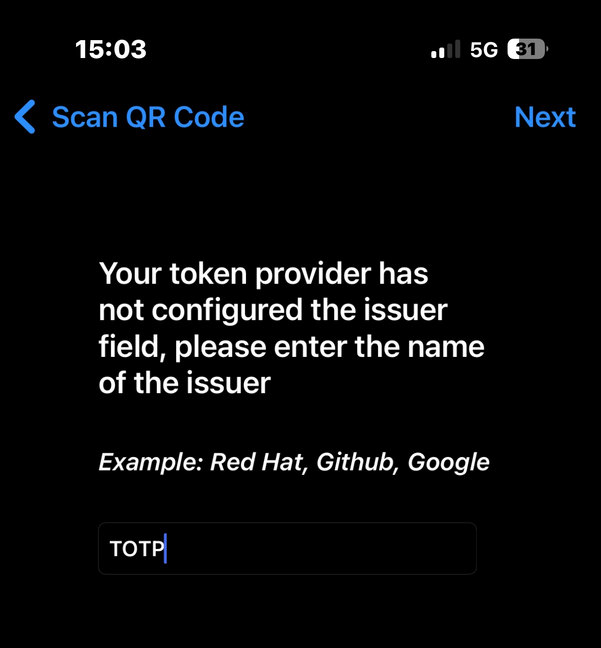

# Situation – Exploitation des services - Mise en place d'un DNS recursif + TOTP + ETCKeeper

**Contexte :** CUB  
**Réalisé par :** Lucien BESCOS  


---


## Sommaire

<!-- Sommaire auto généré -->
- [Contexte : CUB](#contexte--cub)
- [Mise en place d’un serveur DNS Recursif avec redondance](#mise-en-place-dun-serveur-dns-recursif-avec-redondance)
  - [1 / Installation – Paramétrage réseau du serveur](#1--installation--paramétrage-réseau-du-serveur)
  - [Définir le serveur DNS récursif à utiliser](#définir-le-serveur-dns-récursif-à-utiliser)
  - [2 / Installation de unbound](#2--installation-de-unbound)
  - [Configuration de unbound](#configuration-de-unbound)
- [Le secret partagé TOTP](#2--le-secret-partagé-totp)
- [Connexion en SSH à mon serveurs DNS](#3--connexion-en-ssh-à-mon-serveurs-dns)
- [Versionning](#versionning)
  - [1 / Mise en place et prise en main d’etckeeper](#1--mise-en-place-et-prise-en-main-detckeeper)
  - [2 / Initialisation du dépôt](#2--initialisation-du-dépôt)
  - [3 / Test de l’intégration avec APT](#3--test-de-lintégration-avec-apt)
  - [4 / Création d’une sauvegarde complète de /etc](#4--création-dune-sauvegarde-complète-de-etc)
  - [5 / Test](#5--test)


---

# Mise en place d’un serveur DNS Recursif avec redondance 

## 1 / Installation – Paramétrage réseau du serveur 

```bash
sudo apt update && sudo apt upgrade
sudoedit /etc/network/interfaces
```


Adapter nos paramètre en fonction de notre contexte.

### Définir le serveur DNS récursif à utiliser

```bash
sudoedit /etc/resolv.conf
```

```
nameserver 8.8.8.8
# Lorsque le service Unbound sera opérationnel, remplacer 8.8.8.8 par 127.0.0.1
# et ajouter ensuite le second serveur récursif produit par votre binôme.
```

```bash
sudo systemctl restart networking
sudoedit /etc/hostname
```

```
dns0
```

```bash
sudoedit /etc/hosts
```


Adapter en fonction de notre contexte.

Il est nécessaire de redémarrer le serveur pour prendre en compte le changement de nom.
```bash
sudo shutdown -r now
```

---

## 2 / Installation de unbound 

```bash
sudo apt install unbound
```

### Configuration de unbound


```
interface: 192.168.4.10 // Adresse IP de notre machine
interface: 127.0.0.1 // Adresse IP local pour le lookback
access-control: 192.168.4.0/24 allow // Autoriser les clients du VLAN 192.168.4.0/24 à interroger le serveur DNS
access-control: 0.0.0.0/0 refuse // Refuser toute requête venant de réseaux non autorisés
```

```bash
sudo unbound-checkconf
# Vérifie si aucune erreur n'est présente
```

On récupère les adresses des serveurs racines et nous les stockons dans le fichier `/var/lib/unbound/root.hints` :

```bash
sudo curl --output /var/lib/unbound/root.hints https://www.internic.net/domain/named.cache
sudo chown -R unbound:unbound /var/lib/unbound/
sudo touch /var/log/unbound.log
sudo chown unbound:unbound /var/log/unbound.log
sudo systemctl restart unbound 
sudo systemctl status unbound
```

---

## 2 / Le secret partagé TOTP 

```
HOTP/T30/6 etudiant - 5e7aef3eb075e3905f5a6d15b4ebf94636bb0a81
root@debian:~# oathtool -v -d 6 5e7aef3eb075e3905f5a6d15b4ebf94636bb0a81
Hex secret: 5e7aef3eb075e3905f5a6d15b4ebf94636bb0a81
Base32 secret: LZ5O6PVQOXRZAX22NUK3J27ZIY3LWCUB
Digits: 6
Window size: 0
Start counter: 0x0 (0)

→ Secret partagé : 65f43c705ce51c9c058ec8bb4b7f64b656681866
→ Encodage secret (pour QR) : MX2DY4C44UOJYBMOZC5UW73EWZLGQGDG
→ Nombre de chiffres (Digits) : 6
→ Période (Period) : 30s
```


---

## 3 / Connexion en SSH à mon serveurs DNS

    

  


---

# Versionning

## 1 / Mise en place et prise en main d’etckeeper

J’ai vérifié que Git était bien utilisé comme système de versionnement :

```bash
sudoedit /etc/etckeeper/etckeeper.conf
```

Et j’ai confirmé que la ligne était : `VCS="git"`

---

## 2 / Initialisation du dépôt 

Comme il n’était pas encore initialisé, j’ai lancé :

```bash
sudo etckeeper init
sudo etckeeper commit "Commit inital pour /etc"
```

Ça a créé le premier snapshot de /etc avant toute modification.

---

## 3 / Test de l’intégration avec APT

J’ai installé un paquet pour voir comment etckeeper gérait les commits automatiques :

```bash
sudo apt install nginx
```

Etckeeper a automatiquement créé un commit avant l’installation et un commit après.

---

## 4 / Création d’une sauvegarde complète de /etc

Pour sécuriser mes configurations, j’ai fait :

```bash
sudo tar czf etc-backup.tar.gz /etc
```

Monter le commit.

---

## 5 / Test 

Nous pouvons faire un test en installant apache2 puis vérifier les logs et revenir sur la version d’avant.

Puis nous vérifions que etckeeper crée automatiquement un commit après l’installation du paquet.

Ici nous pouvons voir que les changements dans /etc ont bien été pris en compte.

Maintenant je veux restaurer tout le répertoire /etc à une version antérieure.

Ici nous pouvons voir qu’une version antérieure a été restaurée avec git log.
