**4ieme situation - « Paramétrage et sécurisation du service DHCP»**

**Contexte : CUB**

**Réaliser par** **:** Lucien BESCOS 

**Sommaire**

**Context : CUB**

[Question](#_page2_x56.70_y121.55) [1](#_page2_x56.70_y121.55) [:](#_page2_x56.70_y121.55) [Modifier](#_page2_x56.70_y121.55) [la](#_page2_x56.70_y121.55) [maquette........................................................................................................3](#_page2_x56.70_y121.55)

[Question](#_page3_x56.70_y121.55) [2](#_page3_x56.70_y121.55) [:](#_page3_x56.70_y121.55) [Rédiger](#_page3_x56.70_y121.55) [la](#_page3_x56.70_y121.55) [fiche](#_page3_x56.70_y121.55) [de](#_page3_x56.70_y121.55) [tests](#_page3_x56.70_y121.55) [de](#_page3_x56.70_y121.55) [votre](#_page3_x56.70_y121.55) [maquette](#_page3_x56.70_y121.55) [et](#_page3_x56.70_y121.55) [faire](#_page3_x56.70_y121.55) [valider](#_page3_x56.70_y121.55) [celle-ci](#_page3_x56.70_y121.55) [par](#_page3_x56.70_y121.55) [votre](#_page3_x56.70_y121.55) [enseignant. ..............................................................................................................................................................4 ](#_page3_x56.70_y121.55)[Question 3 : Activer et paramétrer le service DHCP sur votre serveur ServeurPrimaireX en respectant le cahier des charges du document 1. Utiliser des commandes powershell pour créer l' étendue DHCP pour le sous-réseau du service « clients » en respectant les informations du document 1...........................................................................................................................................4 ](#_page3_x56.70_y414.05)[Question 4 :.........................................................................................................................................10 ](#_page9_x56.70_y109.55)[Question](#_page9_x56.70_y208.80) [5](#_page9_x56.70_y208.80) [:](#_page9_x56.70_y208.80) [Methode](#_page9_x56.70_y208.80) [de](#_page9_x56.70_y208.80) [mise](#_page9_x56.70_y208.80) [en](#_page9_x56.70_y208.80) [place](#_page9_x56.70_y208.80) [des](#_page9_x56.70_y208.80) [deux](#_page9_x56.70_y208.80) [type](#_page9_x56.70_y208.80) [de](#_page9_x56.70_y208.80) [faillover...................................................10](#_page9_x56.70_y208.80)

[Question](#_page9_x56.70_y358.50) [6](#_page9_x56.70_y358.50) [:](#_page9_x56.70_y358.50) [Mettre](#_page9_x56.70_y358.50) [en](#_page9_x56.70_y358.50) [place](#_page9_x56.70_y358.50) [le Actif/Actif........................................................................................10](#_page9_x56.70_y358.50)

[Question](#_page10_x56.70_y109.55) [7](#_page10_x56.70_y109.55) [:](#_page10_x56.70_y109.55) [Fiche](#_page10_x56.70_y109.55) [tests Actif/Actif....................................................................................................11](#_page10_x56.70_y109.55)

[Question](#_page10_x56.70_y208.80) [8](#_page10_x56.70_y208.80) [:](#_page10_x56.70_y208.80) [Mise](#_page10_x56.70_y208.80) [en](#_page10_x56.70_y208.80) [place](#_page10_x56.70_y208.80) [du Actif/Passif.........................................................................................11](#_page10_x56.70_y208.80)

[Question](#_page10_x56.70_y604.50) [9](#_page10_x56.70_y604.50) [:](#_page10_x56.70_y604.50) [Fiche](#_page10_x56.70_y604.50) [tests Actif/Passif...................................................................................................11 ](#_page10_x56.70_y604.50)[Question 10 : Note sur les vulnérabilités avérées du service DHCP..................................................12](#_page11_x56.70_y151.30)
# **Question 1 : Modifier la maquette** 
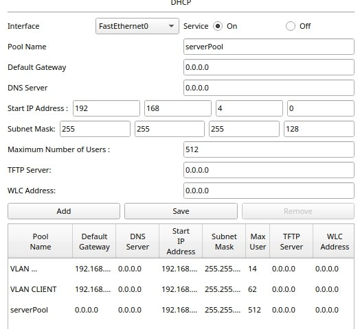

**Question 2 : Rédiger la fiche de tests de votre maquette et faire valider celle-ci par votre enseignant.**

*Test effectués :* Demande de requete DHCP pour l’attribution d’une configuration réseau 

` `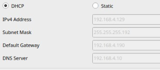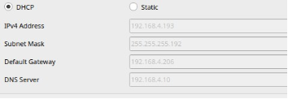

**Question 3 : Activer et paramétrer le service DHCP sur votre serveur ServeurPrimaireX en respectant le cahier des charges du document 1. Utiliser des commandes powershell pour créer l' étendue DHCP pour le sous-réseau du service « clients » en respectant les informations du document 1.**

Dans « Ajouter des roles »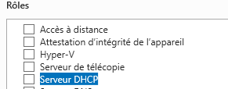

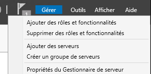

Dans powershell : Création des la plage **:**

*Add-DhcpServerv4Scope -Name "Clients" -StartRange 192.168.4.129 -EndRange 192.168.4.189 - SubnetMask 255.255.255.192*

*Add-DhcpServerv4Scope -Name "AdministrationSystemeReseau" -StartRange 192.168.4.193 - EndRange 192.168.4.205 -SubnetMask 255.255.255.240*

Pour vérifier : 

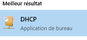 

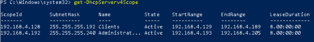

Exlusion d’addresse :

*Add-DHCPServerV4ExclusionRange -ScopeId 192.168.4.192 -StartRange 192.168.4.195 - EndRange 192.168.4.200*

Réservation d’addresse :

Trouver l’addresse mac du clients 

**Ici notre client :** 08-00-27-2D-AB-B4

` `Add-DhcpServerv4Reservation -ScopeId 192.168.4.192 -IPAddress 192.168.4.201 - >> ClientId 08-00-27-2D-AB-B4 -Description "Poste Specifique pour le service"

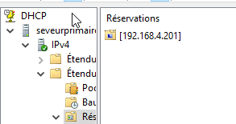

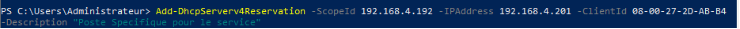

Mettre un bail  de 4h :

Set-DhcpServerv4Scope -ScopeId 192.168.4.192 -LeaseDuration 04:00:00

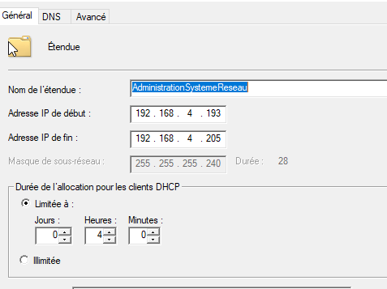

Pour le vlan clients 

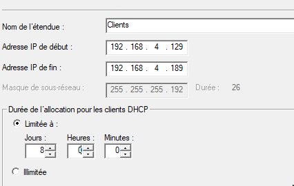

Distribution des passerelles 

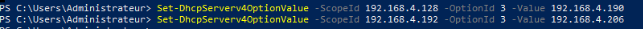

Distribution du Serveur DNS 

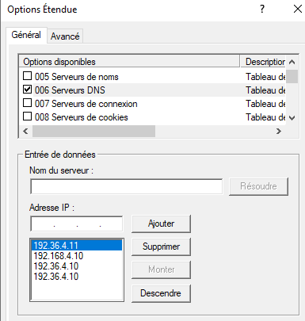

Distribution du Domaine 

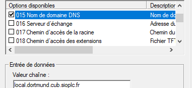

**Question 4 : Update de la maquette packet tracer** 

Packet Tracer fait

**Question 5 : Methode de mise en place des deux type de faillover** 

Fiche procedure

**Question 6 : Mettre en place le Actif/Actif**

![ref1]

**Question 7 : Fiche tests Actif/Actif** 

Voir fiche tests

**Question 8 : Mise en place du Actif/Passif** 

![ref2]

**Question 9 : Fiche tests Actif/Passif**

Voir fiche tests

**Question 10 : Note sur les vulnérabilités avérées du service DHCP**

**Le service DHCP présente certaines vulnérabilités importantes pouvant être exploitées par des attaquants.**

- **Le DHCP Starvation (épuisement d’adresses IP)**

Un DHCP Starvation consiste à saturer le serveur DHCP en lui envoyanCorps de textet un grand nombre de requêtes d’adresses IP à l’aide de faux identifiants MAC.

Le serveur alloue alors toutes les adresses disponibles de son pool à ces faux clients, ce qui provoque l’épuisement des adresses IP.

Conséquence :

Les vrai utilisateur ne peuvent plus obtenir d’adresse IP, ce qui les empêche de se connecter au réseau.

Contre-mesures :

- Activer la fonction de protection DHCP Snooping sur les switch
- Limiter le nombre d’adresses par port ou par utilisateur.
- Surveiller les requêtes DHCP anormales via les journaux du serveur.
- **Rogue DHCP (serveur DHCP illégitime)**

Principe :

Un Rogue DHCP est un serveur DHCP non autorisé branché au réseau.

Il peut répondre plus rapidement que le serveur légitime et attribuer de fausses adresses IP, passerelles, ou DNS.

Cela permet à un attaquant d’intercepter ou rediriger le trafic réseau (attaque de type “Man-in-the- Middle”).

Conséquence :

Risque de vol d’informations, perte de connectivité ou compromission du réseau.

Contre-mesures :

- Activer DHCP Snooping pour bloquer les réponses DHCP provenant de ports non autorisés.
- Définir clairement les ports “trusted” (où le serveur DHCP officiel est connecté).
- Surveiller régulièrement le réseau pour détecter tout serveur DHCP suspect.

**Conclusion**

Le protocole DHCP, bien que pratique, reste une cible privilégiée pour les attaques réseau.
**SIO2 BLOC 2 Réseaux avancé – Contexte : CUB – Réseau avancé **

[ref1]: ../../medias/Aspose.Words.2774bc21-8a8d-4e03-8493-a70e025d6b88.022.jpeg
[ref2]: ../../medias/Aspose.Words.2774bc21-8a8d-4e03-8493-a70e025d6b88.023.jpeg
