` `**5ieme situation - « Paramétrage et sécurisation du service AD »**

**Contexte : CUB**

**Réaliser par** **:** Lucien BESCOS 

**Sommaire**

**Context : CUB**

[Question 1 : Installation des services ADDS et promouvoir le serveur en contrôleur de domaine......4 ](#_page3_x56.70_y148.35)[Question 2 : Ajouter une nouvelle forêt correspondant à votre nom de domaine : local.anvers.cub.sioplc.fr (pour l'agence d'Anvers...)...........................................................................4 ](#_page3_x56.70_y504.80)[Question](#_page4_x56.70_y121.55) [3](#_page4_x56.70_y121.55) [:](#_page4_x56.70_y121.55) [Mot](#_page4_x56.70_y121.55) [de](#_page4_x56.70_y121.55) [passe](#_page4_x56.70_y121.55) [pour](#_page4_x56.70_y121.55) [la](#_page4_x56.70_y121.55) [restauration](#_page4_x56.70_y121.55) [des](#_page4_x56.70_y121.55) [services](#_page4_x56.70_y121.55) [d'annuaire:](#_page4_x56.70_y121.55) [Cub_007..............................5](#_page4_x56.70_y121.55)

[Question](#_page5_x56.70_y121.55) [4](#_page5_x56.70_y121.55) [: Au](#_page5_x56.70_y121.55) [moment](#_page5_x56.70_y121.55) [de](#_page5_x56.70_y121.55) [la](#_page5_x56.70_y121.55) [vérification](#_page5_x56.70_y121.55) [de](#_page5_x56.70_y121.55) [vos](#_page5_x56.70_y121.55) [options,](#_page5_x56.70_y121.55) [afficher](#_page5_x56.70_y121.55) [le](#_page5_x56.70_y121.55) [script](#_page5_x56.70_y121.55) [Powershell](#_page5_x56.70_y121.55) [pour visualiser les commandes utilisées lors de l'installation des services ADDS.......................................6 ](#_page5_x56.70_y121.55)[Question 5 : Nouveau mot de passe pour le compte « administrateur» : CubCub_007.......................6 ](#_page5_x56.70_y576.10)[Question 6 :...........................................................................................................................................7 ](#_page6_x56.70_y171.20)[Question](#_page6_x56.70_y347.00) [7](#_page6_x56.70_y347.00) [:](#_page6_x56.70_y347.00) [Intégrer](#_page6_x56.70_y347.00) [un](#_page6_x56.70_y347.00) [ordinateur](#_page6_x56.70_y347.00) [client](#_page6_x56.70_y347.00) [Windows](#_page6_x56.70_y347.00) [au](#_page6_x56.70_y347.00) [domaine](#_page6_x56.70_y347.00) [(nom](#_page6_x56.70_y347.00) [:](#_page6_x56.70_y347.00) [posteA)................................7](#_page6_x56.70_y347.00)

[Question](#_page7_x56.70_y109.55) [8](#_page7_x56.70_y109.55) [:](#_page7_x56.70_y109.55) [Déplacer](#_page7_x56.70_y109.55) [l'ordinateur](#_page7_x56.70_y109.55) [«](#_page7_x56.70_y109.55) [posteA »](#_page7_x56.70_y109.55) [dans](#_page7_x56.70_y109.55) [l'unité](#_page7_x56.70_y109.55) [d'organisation](#_page7_x56.70_y109.55) [«](#_page7_x56.70_y109.55) [Salle002».......................8](#_page7_x56.70_y109.55)

[Question](#_page7_x56.70_y443.15) [9](#_page7_x56.70_y443.15) [:](#_page7_x56.70_y443.15) [Créer](#_page7_x56.70_y443.15) [dans](#_page7_x56.70_y443.15) [le](#_page7_x56.70_y443.15) [conteneur](#_page7_x56.70_y443.15) [«](#_page7_x56.70_y443.15) [Users](#_page7_x56.70_y443.15) [»](#_page7_x56.70_y443.15) [les](#_page7_x56.70_y443.15) [utilisateurs](#_page7_x56.70_y443.15) [suivants](#_page7_x56.70_y443.15) [:...........................................8 ](#_page7_x56.70_y443.15)[Question 10 : Créer les groupes suivants dans le conteneur « Users » (étendue: Globale; Type : Sécurité) : • Production • Clients • Administration..............................................................................9 ](#_page8_x56.70_y144.40)[Question](#_page8_x56.70_y537.95) [11](#_page8_x56.70_y537.95) [: Ajouter](#_page8_x56.70_y537.95) [des](#_page8_x56.70_y537.95) [membres](#_page8_x56.70_y537.95) [aux](#_page8_x56.70_y537.95) [groupes](#_page8_x56.70_y537.95) [crées](#_page8_x56.70_y537.95) [:......................................................................9](#_page8_x56.70_y537.95)

[Question](#_page9_x56.70_y144.40) [12](#_page9_x56.70_y144.40) [:](#_page9_x56.70_y144.40) [Retrouver](#_page9_x56.70_y144.40) [les](#_page9_x56.70_y144.40) [commandes](#_page9_x56.70_y144.40) [PowerShell](#_page9_x56.70_y144.40) [essentielles](#_page9_x56.70_y144.40) [permettant](#_page9_x56.70_y144.40) [de](#_page9_x56.70_y144.40) [gérer](#_page9_x56.70_y144.40) [en](#_page9_x56.70_y144.40) [ligne](#_page9_x56.70_y144.40) [de commande l'active directory et rédiger la fiche de procédure 6: Powershell - Gestion de l'AD........10 ](#_page9_x56.70_y144.40)[Question](#_page9_x56.70_y290.90) [13](#_page9_x56.70_y290.90) [:](#_page9_x56.70_y290.90) [Réaliser](#_page9_x56.70_y290.90) [à](#_page9_x56.70_y290.90) [l'aide](#_page9_x56.70_y290.90) [de](#_page9_x56.70_y290.90) [commandes](#_page9_x56.70_y290.90) [Powershell](#_page9_x56.70_y290.90) [les](#_page9_x56.70_y290.90) [actions](#_page9_x56.70_y290.90) [suivantes](#_page9_x56.70_y290.90) [:.............................10](#_page9_x56.70_y290.90)

[Question](#_page11_x56.70_y109.55) [14](#_page11_x56.70_y109.55) [:](#_page11_x56.70_y109.55) [Retrouver](#_page11_x56.70_y109.55) [sur](#_page11_x56.70_y109.55) [internet](#_page11_x56.70_y109.55) [la](#_page11_x56.70_y109.55) [méthode](#_page11_x56.70_y109.55) [de](#_page11_x56.70_y109.55) [mise](#_page11_x56.70_y109.55) [en](#_page11_x56.70_y109.55) [place](#_page11_x56.70_y109.55) [d'une](#_page11_x56.70_y109.55) [redondance](#_page11_x56.70_y109.55) [de](#_page11_x56.70_y109.55) [l'active directory et rédiger votre propre procédure: « BTS SIO BLOC 2 AdminSys - Procédure 7 - Configuration d'une redondance de l'Active Directory sous Windows Server 2019 ».......................12](#_page11_x56.70_y109.55)

**A Installation des services ADDS**

**Question 1 : Installation des services ADDS et promouvoir le serveur en contrôleur de domaine.**

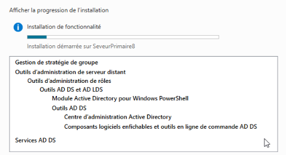

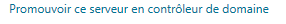
# **Question 2 : Ajouter une nouvelle forêt correspondant à votre nom de domaine :**
# [**local.anvers.cub.sioplc.fr**](http://local.anvers.cub.sioplc.fr/) **(pour l'agence d'Anvers...)**
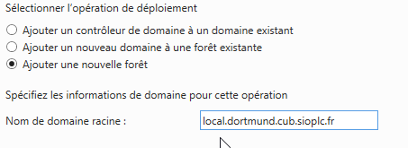
# **Question 3 : Mot de passe pour la restauration des services d'annuaire: Cub\_007**
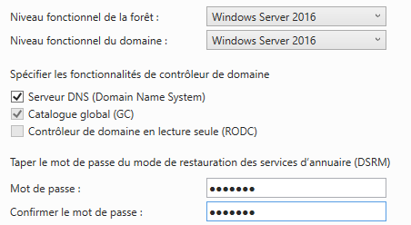
# **Question 4 : Au moment de la vérification de vos options, afficher le script Powershell pour visualiser les commandes utilisées lors de l'installation des services ADDS.**
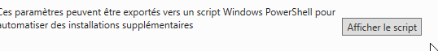

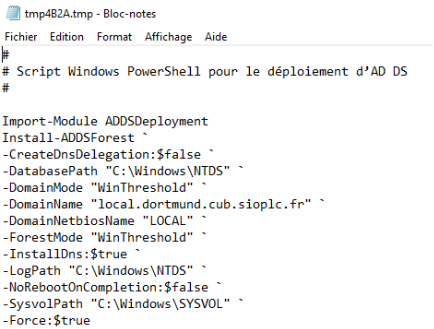
# **Question 5 : Nouveau mot de passe pour le compte « administrateur» : CubCub\_007**
Nouveau mot de passe : CubCub\_007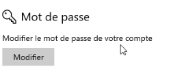

**B Paramétrage de l'active Directory**
# **Question 6 :** 
Nouveau → Unité d’organisation 

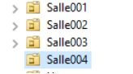
# **Question 7 : Intégrer un ordinateur client Windows au domaine (nom : posteA)**
Dans « Computer » → Nouveau → Ordinateur 

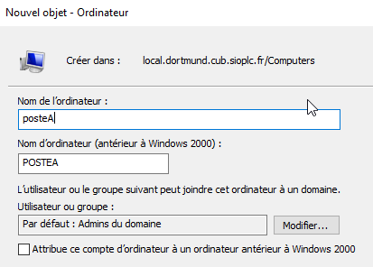
# **Question 8 : Déplacer l'ordinateur « posteA » dans l'unité d'organisation « Salle002»**
Clique droit sur posteA → déplacer 

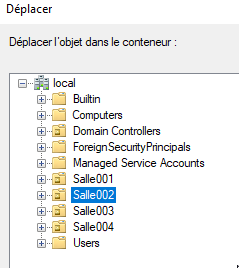
# **Question 9 : Créer dans le conteneur « Users » les utilisateurs suivants :**
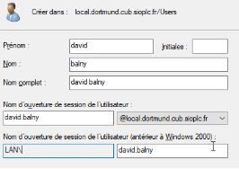 
# **Question 10 : Créer les groupes suivants dans le conteneur « Users » (étendue: Globale; Type :**
# **Sécurité) :**
- # **Production**
- # **Clients**
- # **Administration**
Exemple 

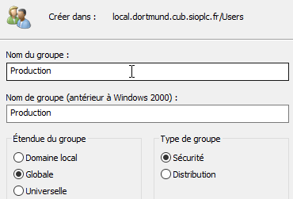
# **Question 11 : Ajouter des membres aux groupes crées :**
- M Balny et M Demouliere : groupe Production
- Mme Ferreira : groupe Administration 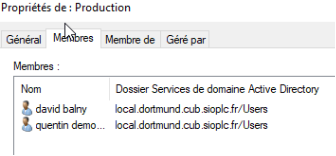
- Mme Caramigeas : groupe Clients 
# **Question 12 : Retrouver les commandes PowerShell essentielles permettant de gérer en ligne de commande l'active directory et rédiger la fiche de procédure 6: Powershell - Gestion de l'AD**
Fiche faite 
# **Question 13 : Réaliser à l'aide de commandes Powershell les actions suivantes :**
- Création d'une unité d'organisation : Salle005
- Déplacer l'ordinateur « posteA » vers l'unité d'organisation « Salle001 »

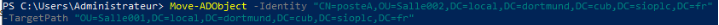

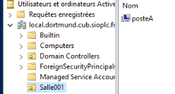

- Créer à l'utilisatrice suivante dans le conteneur « Users » :

  Nom : delouche; Prénom: patricia; mot de passe (à changer à la première connexion) : Provisoire\_007

New-ADUser -Name "patricia delouche" -GivenName "patricia" -Surname "delouche" -SamAccountName "pdelouche" -UserPrincipalName "pdelouche@local.dortmund.cub.sioplc.fr" -AccountPassword (ConvertTo- SecureString "Provisoire\_007" -AsPlainText -Force) -ChangePasswordAtLogon $true -Enabled $true -Path "CN=Users,DC=local,DC=dortmund,DC=cub,DC=sioplc,DC=fr"

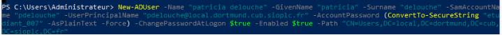

- Créer le groupe « Developpeurs » dans le conteneur « Users »

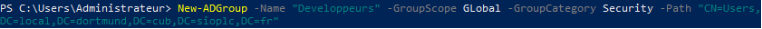

- Ajouter Mme Delouche au groupe « Developpeurs »

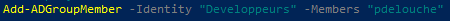

- Lister tous les comptes de l'active directory avec le détail des informations.

# **Question 14 : Retrouver sur internet la méthode de mise en place d'une redondance de l'active directory et rédiger votre propre procédure: « BTS SIO BLOC 2 AdminSys - Procédure 7 - Configuration d'une redondance de l'Active Directory sous Windows Server 2019 ».**
**SIO2 BLOC 2 Réseaux avancé – Contexte : CUB – Réseau avancé **
