# Situation 3  : Administration des systèmes - Introduction a powershell
**Contexte :** CUB  
**Réalisé par :** Lucien BESCOS  


## Sommaire

<!-- Sommaire auto généré -->
- [Question 1 : Connectez-vous en SSH puis exécuter et vérifier la version de votre Powershell.](#question-1--connectez-vous-en-ssh-puis-exécuter-et-vérifier-la-version-de-votre-powershell)
- [Question 2 : Comment visualiser sur votre terminal que Powershell est bien exécuté ?](#question-2--comment-visualiser-sur-votre-terminal-que-powershell-est-bien-exécuté-)
- [Question 3 : Afficher l'ensemble des alias contenus dans Powershell.](#question-3--afficher-lensemble-des-alias-contenus-dans-powershell)
- [Question 4 : Afficher l'aide pour l'utilisation de la commande clear -host.](#question-4--afficher-laide-pour-lutilisation-de-la-commande-clear--host)
- [Question 5 : Quels sont les trois types de commande pouvons-nous retrouver dans les commandes disponibles de Powershell.](#question-5--quels-sont-les-trois-types-de-commande-pouvons-nous-retrouver-dans-les-commandes-disponibles-de-powershell)
- [Question 6 : Tester la commande Get-History, quel est l'intérêt d'utiliser cette commande ?](#question-6--tester-la-commande-get-history-quel-est-lintérêt-dutiliser-cette-commande-)
- [Question 7 : Afficher la liste des processus en cours d'exécution sur le serveur Windows2019. En quoi cette information peut être utile en administration système?](#question-7--afficher-la-liste-des-processus-en-cours-dexécution-sur-le-serveur-windows2019-en-quoi-cette-information-peut-être-utile-en-administration-système)
- [Question 8 : Retrouver les commandes permettant d'afficher page par page la liste des commandes disponibles dans Powershell.](#question-8--retrouver-les-commandes-permettant-dafficher-page-par-page-la-liste-des-commandes-disponibles-dans-powershell)
- [Question 9 : Retrouver et tester les commandes permettant de lister, de démarrer et d'arrêter les services.](#question-9--retrouver-et-tester-les-commandes-permettant-de-lister-de-démarrer-et-darrêter-les-services)
- [Question 10 : Créer en ligne de commande le dossier « procédures ».](#question-10--créer-en-ligne-de-commande-le-dossier--procédures-)
- [Question 11 : Créer avec une commande Powershell un fichier nommé « liste des procédures. txt ».](#question-11--créer-avec-une-commande-powershell-un-fichier-nommé--liste-des-procédures-txt-)
- [Question 12 : Ajouter les deux lignes suivantes dans le fichier nommé « ListeProcédures.txt ».](#question-12--ajouter-les-deux-lignes-suivantes-dans-le-fichier-nommé--listeprocédurestxt-)
- [Question 13 : Réaliser une copie du fichier « ListeProcédures.txt » vers un nouveau fichier de sauvegarde nommé « ListeProcéduresSauvegarde.txt ».](#question-13--réaliser-une-copie-du-fichier--listeprocédurestxt--vers-un-nouveau-fichier-de-sauvegarde-nommé--listeprocéduressauvegardetxt-)

---

## Question 1 : Connectez-vous en SSH puis exécuter et vérifier la version de votre Powershell.

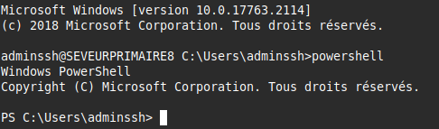

- Connexion en SSH sur powershell « powershell »

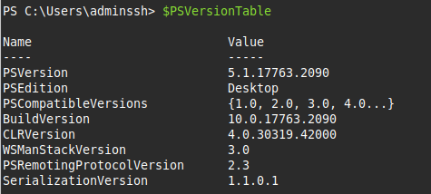

- Version : 5.1.17763.2090

---

## Question 2 : Comment visualiser sur votre terminal que Powershell est bien exécuté ?


- Grâce à l’ajout « PS » à gauche.

---

## Question 3 : Afficher l'ensemble des alias contenus dans Powershell.

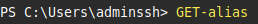

 - Quelques exemples d’alias dans Powershell.

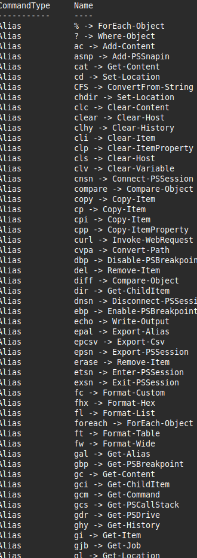


---

## Question 4 : Afficher l'aide pour l'utilisation de la commande clear -host.

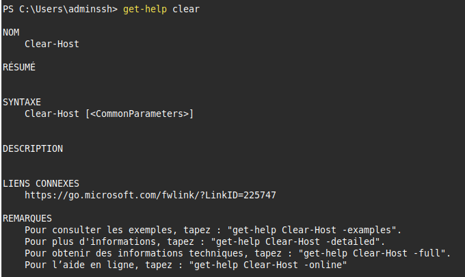

- Affiche les possibilités pour « clear ».

---

## Question 5 : Quels sont les trois types de commande pouvons-nous retrouver dans les commandes disponibles de Powershell.

- Cmdlets : (verbe-nom)
- Fonctions / Scripts : (Commandes personnalisées définies par l’utilisateur)
- Commandes externes (Applications) : (exécutables ou programmes externes)

---

## Question 6 : Tester la commande Get-History, quel est l'intérêt d'utiliser cette commande ?

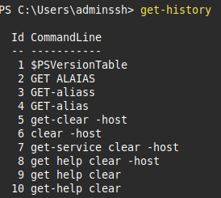

- Nous permet de retrouver des commandes que l’on a faites auparavant si nous avons un souci / afficher l’historique des commandes effectuées.

---

## Question 7 : Afficher la liste des processus en cours d'exécution sur le serveur Windows2019. En quoi cette information peut être utile en administration système?

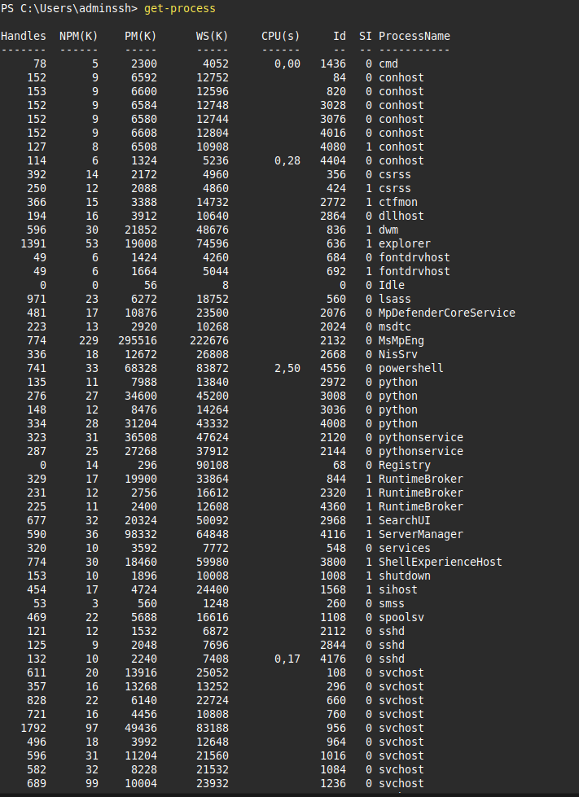

- Voir tous les processus en cours avec la commande est utile car cela permet d’avoir une vision en temps réel de ce qui tourne sur la machine.  
Par exemple, « surveiller notre machine ».

---

## Question 8 : Retrouver les commandes permettant d'afficher page par page la liste des commandes disponibles dans Powershell (l'utilisation d'un pipeline est recommandé).

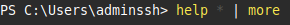

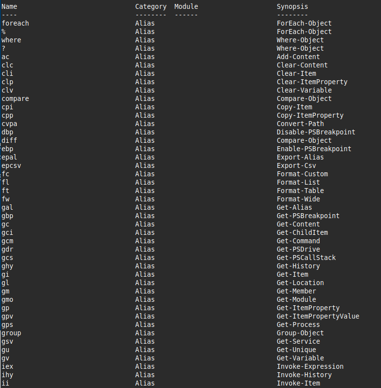

*(Contenu non précisé)*

---

## Question 9 : Retrouver et tester les commandes permettant de lister, de démarrer et d'arrêter les services.

- Liste des services

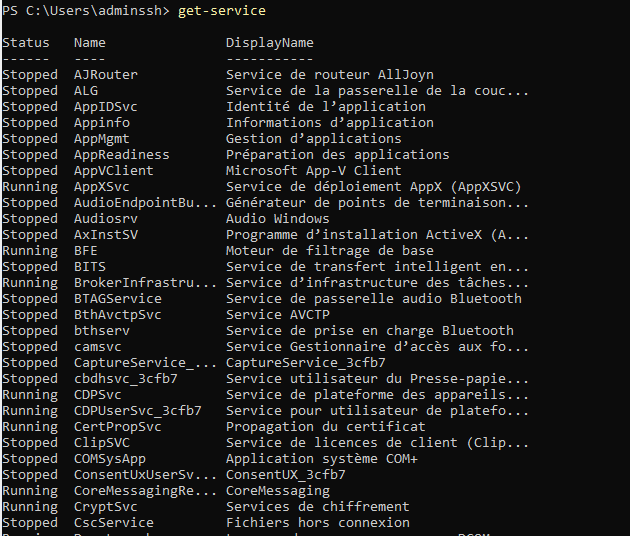

```powershell
Get-Service
```

**Pour démarrer un service :**  
```powershell
Start-Service -Name "NomDuService"
```

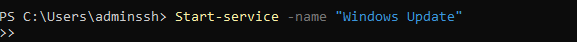


**Pour arrêter un service :**  
```powershell
Stop-Service -Name "NomDuService"
```
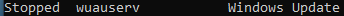

---

## Question 10 : Créer en ligne de commande le dossier « procédures ».

- Création du dossier « procédures ».

```powershell
New-Item -name "procedure" -itemtype directory
```

---

## Question 11 : Créer avec une commande Powershell un fichier nommé « liste des procédures. txt »

- Création du fichier « liste des procédures ».


```powershell
New-Item -name "liste des procedures.txt" -itemtype file
```


Nous pouvons voir notre fichier créé.


---

## Question 12 : Ajouter les deux lignes suivantes dans le fichier nommé « ListeProcédures.txt»

Ajout des lignes dans le fichier en question.

```powershell
Add-Content -Path "ListeProcédures.txt" -Value "Ligne 1"
Add-Content -Path "ListeProcédures.txt" -Value "Ligne 2"
```

---

## Question 13 : Réaliser une copie du fichier « ListeProcédures.txt» vers un nouveau fichier de sauvegarde nommé « ListeProcéduresSauvegarde.txt ».

Nous pouvons voir que nous avons bien copié le fichier en question vers la bonne destination et que tous les éléments présents ont bien été « sauvegardés ».

```powershell
Copy-Item -Path "ListeProcédures.txt" -Destination "ListeProcéduresSauvegarde.txt"
```
