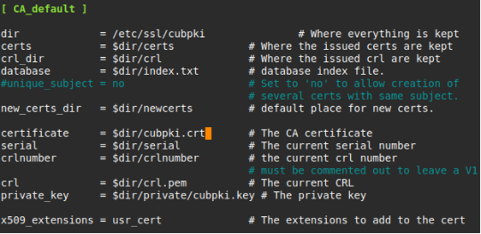
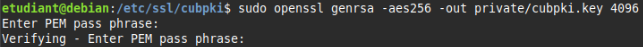
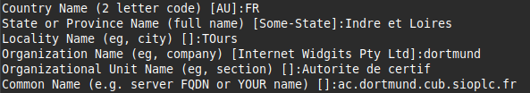
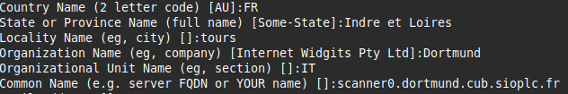
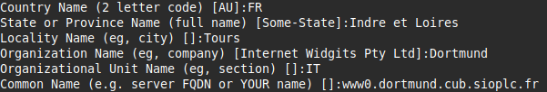
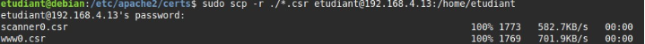
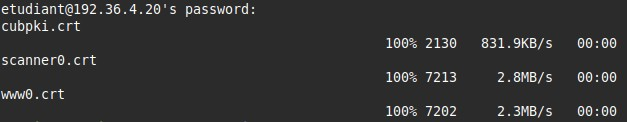
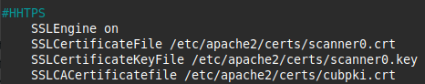
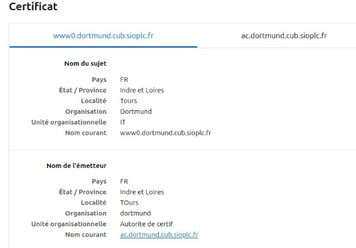

**Mise en place d’une PKI interne **

**Contexte : CUB**

**Réaliser par** **:** Lucien BESCOS 

**Sommaire**

**Context : CUB**

[Mise en place d’une PKI (autorité de certification) interne pour la gestion des certificats avec OpenSSL...............................................................................................................................................3 ](#_page2_x56.70_y121.55)[Construction de l’arborescence de l’autorité :......................................................................................3 ](#_page2_x56.70_y203.80)[Initialisation de la clé privée de l’AC :.................................................................................................4 ](#_page3_x56.70_y109.55)[Mise en place de la clé publique de l’AC :...........................................................................................4 ](#_page3_x56.70_y314.75)[Mise en place d’une clé privée sur le serveur web :.............................................................................4 ](#_page3_x56.70_y537.55)[Mise à niveau des virtualhosts :............................................................................................................6 ](#_page5_x56.70_y423.20)[Vérification :.........................................................................................................................................7](#_page6_x56.70_y167.25)

**Mise en place d’une PKI (autorité de certification) interne pour la gestion des certificats avec OpenSSL**

**Construction de l’arborescence de l’autorité :**

cd cubpki/

sudo mkdir certs crl newcerts private sudo sh -c "echo '01' > serial"

sudo touch index.txt

sudo cp /usr/lib/ssl/openssl.cnf . sudo nano /etc/ssl/cubpki/openssl.cnf

cubpki.crt  //Certificat de l’AC cubpki.key  // Clé privé de l’AC

**Initialisation de la clé privée de l’AC :**

La commande suivante permet de générer le nouveau certificat de l’autorité de certification valable 1 an au format X509

sudo openssl genrsa -aes256 -out private/cubpki.key 4096

Permet de générer une clé privée RSA de 4096 bits protégée par une passphrase chiffrée avec l’algorithme de chiffrement symétrique AES 256.

**Mise en place de la clé publique de l’AC :**

sudo openssl req -new -x509 -nodes -sha256 -days 365 -key private/cubpki.key -out cubpki.crt

ac.dortmund.cub.sioplc.fr  //FQDN de l’AC pour l’identifier 

**Mise en place d’une clé privée sur le serveur web :**

**Dans** /etc/apache2/certs/

sudo openssl req -new -key scanner0.key -out scanner0.csr sudo openssl req -new -key www0.key -out www0.csr

scanner0.dortmund.cub.sioplc.fr //FQDN du site scanner0 www0.dortmund.cub.sioplc.fr //FQDN du site scanner0 

Ensuite nous devons copier la demande de certificat (.csr) vers l’AC afin que celle-ci la signe et génère un certificat signé (.crt). 

sudo scp -r ./\*.csr etudiant@192.168.4.13:/home/etudiant 192.168.4.13  //IP de l’AC

**Signature de la demande et production du certificat par l ‘AC sur le serveur PKI :**

sudo openssl ca -config ./openssl.cnf -policy policy\_anything -out scanner0.crt -infiles /home/etudiant/scanner0.csr

sudo openssl ca -config ./openssl.cnf -policy policy\_anything -out www0.crt -infiles /home/etudiant/www0.csr

Puis nous renvoyons les certificats signés au serveur web pour les 2 sites sudo scp -r ./\*.crt etudiant@192.36.4.20:/home/etudiant

Nous pouvons verifiez les envois dans **/home/etudiant** sur le serveur web avec la commande « ls » 

Pour des raisons de bonnes pratiques il est conseillé de deplacer les certifiact stocker dans **/home/etudiant/** dans **/etc/apache2/certs/** grace a la commande** :

sudo mv ./\*.crt /etc/apache2/certs/

**Mise à niveau des virtualhosts :** 

Nous devons donc configurer nos 2 virtualhots afin d’y renseigner les certificat et les clés, donc : sudo nano /etc/apache2/sites-available/scanner0.conf

sudo nano /etc/apache2/sites-available/www0.conf

SSLCertificateFile /etc/apache2/certs/scanner0.crt – www0.crt SSLCertificateKeyFile /etc/apache2/certs/scanner0.key --- www0.key SSLCACertificatefile /etc/apache2/certs/cubpki.crt

**Vérification :**

**SIO 2 - Bloc 2 - Administration et exploitation des services - Contexte : CUB **
