**Redirection des dommaines via des VirtualHosts – TLS - HTTPS**Installation d'un serveur LAMP (Linux/Apache/MySQL/PHP)**
LAMP signifie :

- **L**inux (Debian 12)
- **A**pache2 (serveur web)
- **M**ariaDB (base de données)
- **P**HP (langage serveur)

*sudo apt install apache2*

*sudo apt install php mariadb-server php-mysql libapache2-mod-php*

**Notes** 

- apache2 → installe le serveur web.
- php et libapache2-mod-php → permettent à Apache d’interpréter les pages PHP.
- mariadb-server et php-mysql → ajoutent la base de données et le connecteur PHP.
##**Création des VirtualHost**
Héberger plusieurs sites web sur le même serveur grâce à des noms de domaine différents (ex. www0 et www1).

**sudoedit /etc/apache2/sites-available/www0.conf** 

<VirtualHost \*:80> #Ecoute sur le port 80 

`        `ServerName www0.dortmund.cub.sioplc.fr

`        `ServerAlias www0.dortmund.cub.sioplc.fr

`        `ServerAdmin etudiant@dortmund.cub.sioplc.fr

`        `ErrorLog /var/log/apache2/www0.dortmund.cub.sioplc.fr-error\_log

`        `CustomLog /var/log/apache2/www0.dortmund.cub.sioplc.fr-access\_log combined

`        `DocumentRoot "/var/www/html/www0" #Doit etre le meme chemin de **ton installation WordPress**, là où se trouvent tous les fichiers du site (wp-admin, wp-content, wp-config.php, etc.).

`        `<Directory "/var/www/html/www0"> #Idem

`                `Options Indexes FollowSymLinks

`                `AllowOverride All

`                `Require all granted

`        `</Directory>

</VirtualHost>

**Apres avoir configurer nos VHOST,** sudo a2ensite www0

sudo systemctl reload apache2
##**Installation de Wordpress**
URL : IP du serveur 

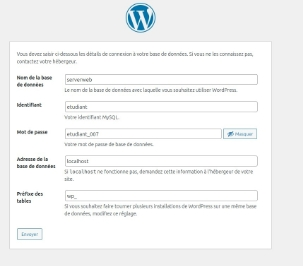 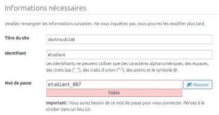

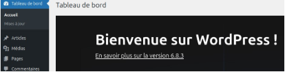
##**Configurer le serveur DNS autoritaire** 
Dans le fichier de zone du serveur nous alons rajouter les enregitrement correctement afin de faire des correspondence IP et des Alias pour la redirection 

Dans : **var/cache/bind/db.dortmund.cub.sioplc.fr**

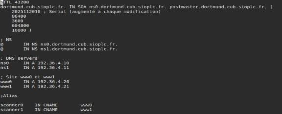

Ne pas oublier de redémarrer le service apres avoir modifier des enregistrement dans la configuration 

*sudo systemctl restart bind9*
##**Configuration du site via GIT Clone** 
Nous avons un depot git sut github, nous avons juste a recuperer le liens du depot 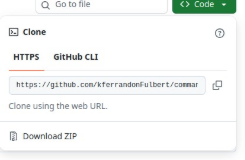

Puis nous allons dans 

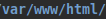

Pour introduire le clone du git dans le dossier pour « scanner0 » *mkdir scanner0*

*sudo git clone « lien copié »* 

Puis nous pouvons voir un nouveau dossier crée avec le clone ainsi que toutes les dépendances 

**Ne pas oublier de changer le chemin de notre VirtualHost** 

<VirtualHost \*:80>

`        `ServerName scanner0.dortmund.cub.sioplc.fr

`        `ServerAlias scanner0.dortmund.cub.sioplc.fr

`        `ServerAdmin etudiant@dortmund.cub.sioplc.fr

`        `ErrorLog /var/log/apache2/scanner0.dortmund.cub.sioplc.fr-error\_log

`        `CustomLog /var/log/apache2/scanner0.dortmund.cub.sioplc.fr-access\_log combined

|`  `DocumentRoot "/var/www/html/scanner0|/**command-attack**|
| - | - |
|||
`        `<Directory "/var/www/html/scanner0/**command-attack/**">                 Options Indexes FollowSymLinks

`                `AllowOverride All

`                `Require all granted

`        `</Directory>

</VirtualHost>

**Apres avoir configurer nos VHOST,** sudo a2ensite www0

sudo systemctl reload apache2

**Pour tester, idem nous allons maintenant taper l’URL** <http://scanner0.dortmund.cub.sioplc.fr/command-attack/>

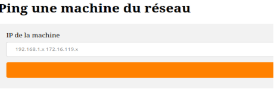

Maintenant il est question de sécurise l’accès a ce Vhost car celui-ci contrairement au WordPress est priver, nous allons essayer de demander un login et un mot de passe pour accéder au service 
1. ## **Activer les modules Apache requis**
sudo a2enmod auth\_basic sudo a2enmod authz\_host sudo systemctl restart apache2
2. ## **Créer le fichier htpasswd**
sudo htpasswd -c /etc/apache2/.htpasswd admin

(Un mot de passe sera demandé)

Identifiant : **admin** 

Mot de passe : **etudiant\_007**

3. **Adapter le Virtualhost**

<VirtualHost \*:80>

`    `ServerName scanner0.dortmund.cub.sioplc.fr

`    `ServerAlias scanner0.dortmund.cub.sioplc.fr

`    `ServerAdmin etudiant@dortmund.cub.sioplc.fr

`    `DocumentRoot "/var/www/html/scanner0/command-attack/"

`    `<Directory "/var/www/html/scanner0/command-attack/">         Options Indexes FollowSymLinks

`        `AllowOverride All

`        `AuthType Basic

`        `AuthName "Accès restreint - Scanner Réseau"         AuthUserFile /etc/apache2/.htpasswd

`        `<RequireAll>

`            `Require ip 192.168.4.192/28             Require valid-user

`        `</RequireAll>

`    `</Directory>

`    `ErrorLog ${APACHE\_LOG\_DIR}/scanner0-error.log

`    `CustomLog ${APACHE\_LOG\_DIR}/scanner0-access.log combined </VirtualHost>

**Port monitoring** 

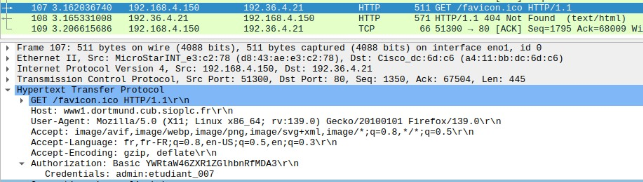

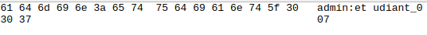

**Mise en place de HTTPS**

Généré mon certificat auto-signé Attention ! Un certificat utilise = un site 

sudo mkdir certs

cd certs/

sudo openssl req -newkey rsa:4096 -keyout docs.key -x509 -days 365 -out docs.crt

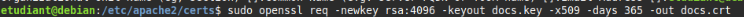

Explication : 

- **sudo** : exécute la commande avec les droits administrateur.
- **openssl req** : lance la création d’une demande de certificat (CSR) ou d’un certificat auto-signé.
- **-newkey rsa:4096** : génère une nouvelle clé privée RSA de 4096 bits.
- **-keyout docs.key** : enregistre la clé privée générée dans le fichier *docs.key ( « docs » = mettre nom de notre serveur web)*
- **-x509** : crée directement un certificat X509 auto-signé (pas seulement une demande).
- **-days 365** : définit la durée de validité du certificat à 365 jours.
- **-out docs.crt** : enregistre le certificat généré dans le fichier *docs.crt*. *( « docs » = mettre nom de notre serveur web)*

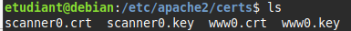

**Passphrase :** etudiant\_007

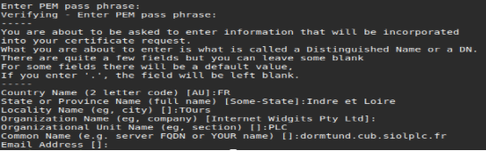

Modification de mes virtualhosts

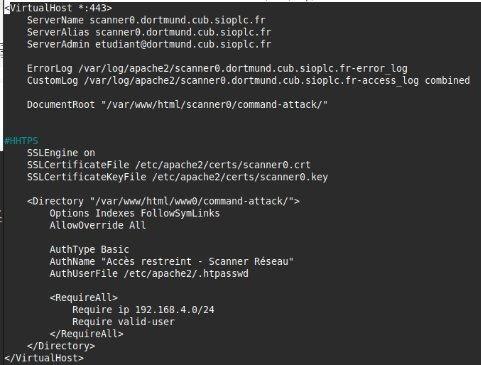

<VirtualHost \*:443> 

|/|443 = port HTTP|
| - | - |
|||
**Aj**outé la configuration SSL obligatoire SSLEngine on

SSLCertificateFile /etc/apache2/certs/scanner0.crt //Elles servent à activer HTTPS + 

charger ton certificat auto-signé.

SSLCertificateKeyFile /etc/apache2/certs/scanner0.key sudo service apache2 reload // Besoins de la Passphrase 

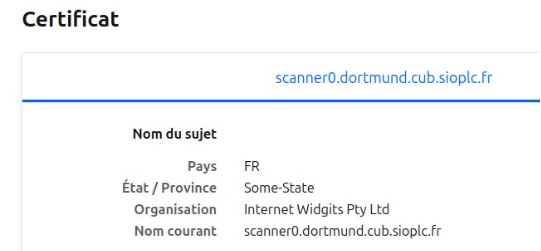
**SIO 2 - Bloc 2 - Administration et exploitation des services - Contexte : CUB **
